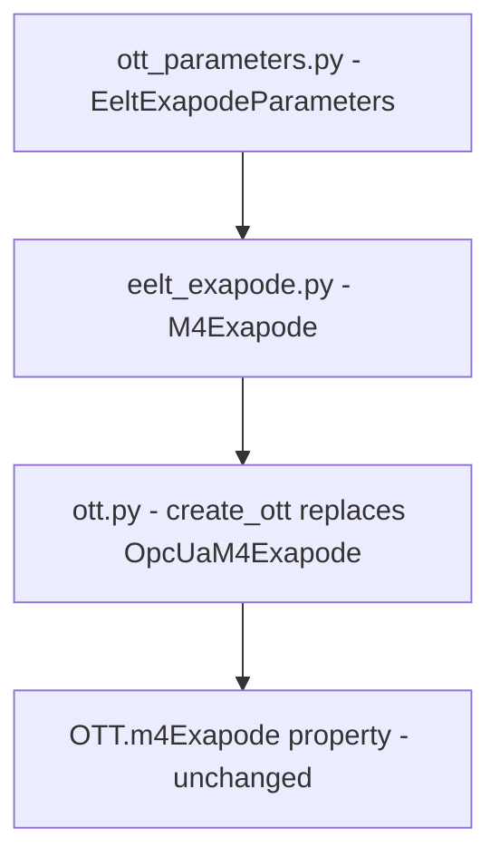

# EELT Exapode Integration Plan

## Goal

Implement the real EELT Exapode (M4's hexapod, commanded via the EELT-Console C# project) as a
new Python device class `M4Exapode` in `m4/devices/eelt_exapode.py`, replacing the existing stub
`OpcUaM4Exapode` in the `create_ott()` factory. The OTT attribute name `m4Exapode` and the
OTT class interface remain unchanged. No simulator/fake changes are needed.

---

## Architecture Findings

### EELT-Console Communication Protocol

The EELT-Console C# project (`/home/pietrof/Downloads/EELT-Console/`) controls the Kinematics
Server (KS) — the real-time hexapod controller — using:

| Direction          | ZMQ Pattern         | Topic                   | Payload message      |
|--------------------|---------------------|-------------------------|----------------------|
| KS → Python (read) | PUB (KS) / SUB (us) | `ks:hp:mirror_pos`      | `HpMirrorPos`        |
| Python → KS (write)| PUB (us) / SUB (KS) | `ks:hp:setpoint_dof`    | `HpSetpointDof`      |

**Message framing** — every ZMQ message is 3 frames (multipart):

```
Frame 0 — filter   : 4-byte little-endian MurmurHash3 of topic name + 1-byte version (= 0x01)
Frame 1 — header   : serialized elt.mal.zpb.dtf.Header protobuf2 (timestamp, topicId, sampleSeq, typeHash)
Frame 2 — payload  : serialized application protobuf2 message
```

**Protobuf wire formats** (from `ADS_KS.proto`):

```
// HpMirrorPos (telemetry, topic ks:hp:mirror_pos)
message HpMirrorPos {
  repeated double actual   = 1 [packed=true];  // [m][rad] {TX, TY, TZ, RX, RY, RZ}
  repeated double setpoint = 2 [packed=true];  // [m][rad]
}
// Wire layout of `actual` array: 0x0A 0x30 <48 bytes: 6 little-endian float64>

// HpSetpointDof (command, topic ks:hp:setpoint_dof)
message HpSetpointDof {
  repeated double hp_setpoint = 1 [packed=true];  // [m][rad] {TX, TY, TZ, RX, RY, RZ}
}
// Wire layout of hp_setpoint: 0x0A 0x30 <48 bytes: 6 little-endian float64>
```

Since both arrays are `packed repeated double` at field 1, the binary encoding is fixed and
predictable. **No `protobuf` Python package is needed**; `struct` is sufficient, consistent
with the existing `dp_motors.py` approach.

**Hardcoded MurmurHash3 values** (from `frmMain.cs` `murmurHash` dict):

| Topic name                  | Hash (int32, little-endian) |
|-----------------------------|-----------------------------|
| `ks:hp:mirror_pos`          | `1904128233`                |
| `ks:hp:setpoint_dof`        | `-248262858`                |

**Units**: KS uses meters for TX/TY/TZ and radians for RX/RY/RZ.
M4 Python uses mm for all 6 DOF. Conversion: `× 1e-3` (m→mm) and `÷ 1e-3` (mm→m).

**Ports** (from `Properties.Settings.Default.*`, default values to be confirmed with hardware team):

| Parameter             | Direction   | Default | Meaning                          |
|-----------------------|-------------|---------|----------------------------------|
| `sub_ip`              | KS → Python | TBD     | IP address of the KS host        |
| `sub_port`            | KS → Python | 6660    | KS PUB port (from proto comment) |
| `pub_port`            | Python → KS | TBD     | Python PUB port (KS connects)    |

---

## M4 Integration Points

The complete change set spans 9 files: 2 new files (real device, fake device) and 7 file edits.

### DOF Convention

The KS emits 6-DOF arrays `[TX, TY, TZ, RX, RY, RZ]` matching the M4 Python convention
already used by `FakeM4Exapode`. No reordering is needed.

---

## File-by-File Plan

### 1. NEW — `m4/devices/eelt_exapode.py`

Real device class **`M4Exapode`** (same name as the OTT attribute, replacing the existing stub):

```python
class M4Exapode:
    def __init__(self, sub_ip, sub_port, pub_port):
        ...
    def getPosition(self) -> np.ndarray:
        # SUB socket → receive last HpMirrorPos frame → decode `actual` field → mm
    def setPosition(self, absolute_position_in_mm):
        # build HpSetpointDof payload → encode filter+header+payload → PUB socket
    def getPositionInM(self) -> np.ndarray:
        return self.getPosition() * 1e-3
    def setPositionInM(self, absolute_position_in_m):
        self.setPosition(np.array(absolute_position_in_m) * 1e3)
```

Key implementation details:
- `_sub_socket`: `zmq.SUB`, connects to `tcp://sub_ip:sub_port`, subscribes to `""` (all)
- `_pub_socket`: `zmq.PUB`, binds to `tcp://*:pub_port`
- `getPosition()`: calls `_sub_socket.recv_multipart(flags=zmq.NOBLOCK)`, takes frame[2],
  parses `struct.unpack('<6d', payload[2:50])` → converts m→mm
- `setPosition()`: builds `payload = b'\x0a\x30' + struct.pack('<6d', *pos_m)`,
  filter frame = `struct.pack('<i', HASH_SETPOINT_DOF) + b'\x01'`,
  header frame = minimal serialized Header (epoch=now, topicId=hash, sampleSeq=counter),
  sends `pub_socket.send_multipart([filter, header, payload])`

> **Note on Header serialization:** The `elt.mal.zpb.dtf.Header` has all-optional fields. A
> minimal valid serialization contains only field 2 (topicId, int32 wire-type 0). For
> robustness, implement a `_encode_header(topic_hash, seq)` helper that manually builds the
> varint-encoded protobuf bytes.

### 2. EDIT — `m4/configuration/ott_parameters.py`

Add a new class `EeltExapodeParameters` (or inline constants) for the new device:

```python
class EeltExapodeParameters:
    sub_ip:      str = "192.168.x.x"  # KS telemetry host — confirm with hardware team
    sub_port:    int = 6660           # KS publishes telemetry here
    pub_port:    int = 6661           # Python publishes commands here (KS subscribes)
    zmq_version: int = 1              # filter frame version byte
```

### 3. EDIT — `m4/configuration/ott.py`

Three changes in this file:

**a. Replace the existing OpcUaM4Exapode import** with the new class:
```python
# Remove:  from m4.devices.m4_exapode import OpcUaM4Exapode
# Add:
from m4.devices.eelt_exapode import M4Exapode
from m4.configuration.ott_parameters import EeltExapodeParameters as _eeltp
```

**b. Replace the `m4Exapode` branch in `create_ott()`** (~line 132):
```python
# Before:
if config["m4Exapode"] is True:
    m4 = FakeM4Exapode()
else:
    m4 = OpcUaM4Exapode(opcUa)

# After:
if config["m4Exapode"] is True:
    m4 = FakeM4Exapode()
else:
    m4 = M4Exapode(
        sub_ip=_eeltp.sub_ip,
        sub_port=_eeltp.sub_port,
        pub_port=_eeltp.pub_port,
    )
```

**c. No changes** to `OTT.__init__()`, `OTT.m4Exapode` property, or `__repr__` —
the attribute and property names stay `_m4Exapode` / `m4Exapode` unchanged.

### 4. EDIT — `m4/__init__.py`

No change needed: `"m4Exapode"` is already in the devices list and defaults. The config
key `m4Exapode` continues to gate between `FakeM4Exapode` and the new real `M4Exapode`.

### 5. EDIT — `__init_scripts__/pyott.py`

No change needed for the same reason — `m4Exapode` key is already present.

### 6. EDIT — `m4/configuration/ott_status.py`

No change needed: the key `"M4"` → `"m4Exapode"` mapping and the `ott.m4Exapode.getPosition()`
call already exist. The new `M4Exapode` class implements `getPosition()` so this works
transparently.

---

## Dependency Graph



---

## Open Questions for Hardware Team

Before connecting to the real KS:

1. What is the IP address of the KS host?
2. What port does the KS bind its PUB socket (telemetry)? (assumed 6660 from proto comment)
3. What port should Python bind its PUB socket (commands) — or does the KS connect to a fixed port?
4. What is the `filter_version` byte in the live system (assumed 1)?
5. Should `ks:hp:setpoint_legs` (leg-space) be supported in addition to `ks:hp:setpoint_dof` (DOF-space)?
6. Does the KS require the Header `typeHash` field to be correct, or can it be 0?
7. Are there any safety/enable steps needed before `ks:hp:setpoint_dof` is accepted (e.g., `ks:hp:loop` close)?
